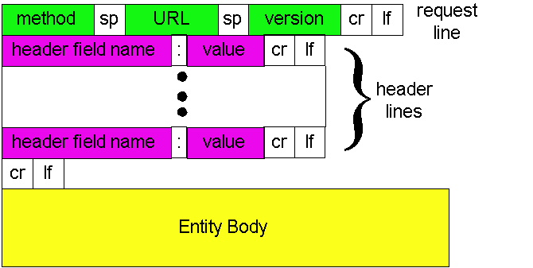
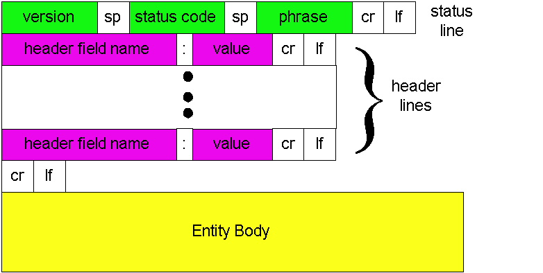
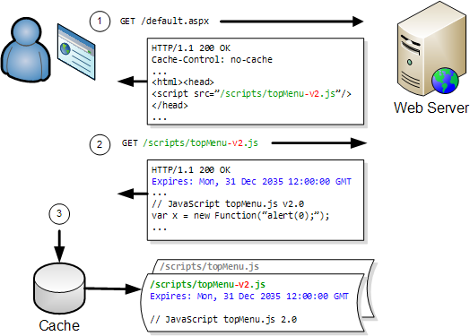
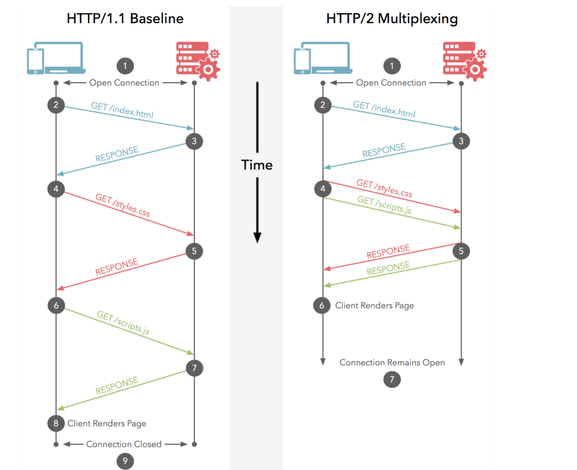
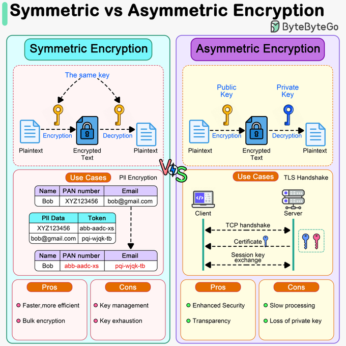
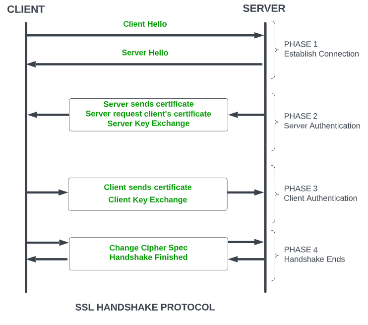
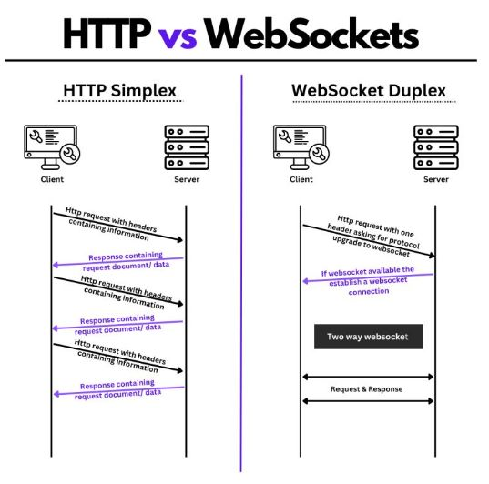
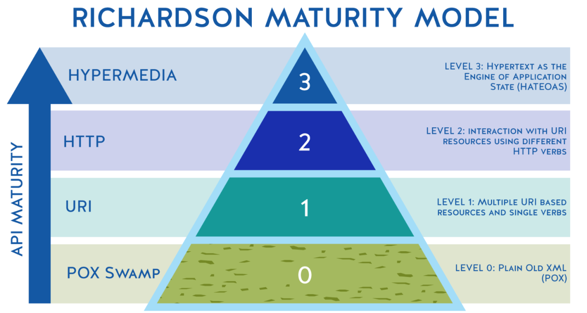

# Conhecendo o Spring Framework

- [Internet](#principais-protocolos-de-comunicação-da-internet)
- [Springboot](#imersão-no-spring-framework-com-spring-boot)
- [API Rest](#criando-uma-api-rest-documentada-com-spring-web-e-swagger)
- [Segurança](#adicionando-segurança-a-uma-api-rest-com-spring-security)
- [Projetos](#projetos)

## Principais Protocolos de Comunicação da Internet

### Web HTTP

> HyperText Transfer Protocol (HTTP): Protocolo de transferência que habilita a comunicação entre diferentes sistemas, permitindo a transferência de informações e dados por uma rede.



    GET /somedir/page.html HTTP/1.1
    Connection: close
    User-agent: Mozilla/4.0
    Accept: text/html, image/gif, image/jpeg
    Accept-language:fr

- **Requests** são mensagens enviadas pelo cliente para iniciar uma ação no servidor.
  - Request Line:
    - **Método HTTP** (GET, PUT, POST...) /URL / Versão;
      - GET: Solicita recurso;
      - HEAD: GET sem corpo de resposta
      - POST: Submete uma entidade a um recurso
      - PUT: Substituição de recursos pelos dados da requisição
      - DELETE: Remoção de um recurso;
      - TRACE: Chamada loop-back a um determinado recurso;
      - OPTION: Opções de comunicação com recurso;
      - CONNECT: Tunelamento identificado pelo recurso;
      - PATCH: Modificação parcial;
  - Header Lines:
    - Tipo de conexão;
    - Agente;
    - Preferência do cliente;
    - Etc;
  - Body



    HTTP/1.1 200 OK
    Connection: close
    Date: Thu, 06 Aug 1998 12:00:15 GMT
    Server: Apache/1.3.0 (Unix)
    Last-Modified: Mon, 22 Jun 1998 09:23:24 GMT
    Content-Length: 6821
    Content-Type: text/html
    data data data data data ...

- **Respostas** fornecem informações sobre o resultado de um requisição.
  - Status Line:
    - Versão / Status / Frase
      - 200 OK: Sucesso;
      - 301 Moved Permanently: Objeto realocado;
      - 400 Bad Request: Servidor não compreendeu a requisição;
      - 404 Not Found: Inexistente;
  - Header Lines:
    - Connection;
    - Date;
    - Server;
    - Content-type: XML, JSON, etc.
    - Etc;
  - Body:

O **Transmission Control Protocol** (TCP) é um protocolo de transporte que opera na camada de transporte do modelo TCP/IP.

- 3-Way Handhsake:
  1. **SYN**: Cliente desejando estabelecer conexão com o servidor, envia um segmento com o bit SYN definido.
  2. **SYN + ACK**: O servidor responde à solicitação com os bits SYN-ACK definidos. O ACK confirma o recebimento do segmento e o SYN indica com qual número de sequência o servidor começará os segmentos.
  3. **ACK**: O cliente confirma a resposta do servidor, possibilitando ambos estabelecerem uma conexão confiável.
  4. Para encerrar conexão, substitui-se o **SYN** pelo **FIN**.

O protocolo HTTP é considerado _stateless_ por tratar cada solicitação feita a um servidor de forma independente das demais, cada solicitação é uma transação completa e autônoma.


- **Cookies** são pequenos pedaços ou blocos de dados criados e utilizados pelo servidor para persistir dados no dispositivo do cliente. São usados para manter o estado da aplicação entre diferentes solicitações HTTP.
  1. Browser realiza uma requisição;
  2. Server cria cookies para o usuário e os enviam com `Set-Cookie`;
  3. Browser recebe e armazena localmente os cookies, os enviando em futuras requisições (http-request, Cookie);
  4. Servidor recebe requisições com cookies e os validam, reconhecendo estado (Session Management, Personalizations, Tracking, etc.).
  - Persistentes e de sessão;



- **Cache** é uma forma de armazenar dados de forma que possam ser acessados mais rapidamente. No contexto de HTTP, o cache geralmente é usado para evitar solicitações extras de recursos comumente usados.



- Formato de Dados:
  - 1.1: Comandos baseados em texto;
  - 2.0: Comandos binários;
- Multiplexação:
  - 1.1: Usa uma conexão separada para cada solicitação e resposta;
  - 2.0: Suporta multiplexação, permitindo várias solicitações e respostas simultâneas;
- Priorização:
  - 1.1: Não possui priorização embutida;
  - 2.0: Permite que os desenvolvedores personalizem a priorização ou ordem que os recursos são carregados;
- Compressão de Cabeçalho:
  - 1.1: Não suporta;
  - 2.0: Introduziu HPACK para reduzir a sobrecarga;
- Segurança:
  - 1.1: Não exige criptografia;
  - 2.0: A especificação não exige, mas quase todas as implementações exigem criptografia;

### HTTPS

> Hypertext Transfer Protocol Secure, é a versão segura por criptografia do HTTP.





O **SSL (Secure Sockets Layer)** é um protocolo de segurança da internet baseado em criptografia.

1. Um navegador ou servidor tenta se conectar a um site (por exemplo, um servidor Web) protegido por um certificado SSL.
2. O navegador ou servidor solicita que esse servidor Web se identifique.
3. Como resposta, o servidor Web envia uma cópia do seu certificado SSL para o navegador ou servidor.
4. O navegador ou servidor verifica se o certificado SSL é de confiança. Se for, ele sinaliza isso ao servidor Web.
5. O servidor Web retorna então uma confirmação assinada digitalmente para dar início a uma sessão criptografada por SSL.
6. Os dados criptografados são compartilhados entre o navegador ou servidor e o servidor Web.

### WebSocket

> WebSocket é um protocolo de comunicação que fornece comunicação bidirecional full-duplex entre um cliente e um servidor.



O WebSocket opera em uma conexão única e de longa duração, enviando e recebendo dados simultaneamente. Ao contrário do HTTP tradicional, onde uma nova conexão é criada para cada solicitação, o WebSocket mantém uma conexão aberta, resultando em menor latência e menos viagens de ida e volta necessárias para a troca de dados. O WebSocket foi desenvolvido para superar algumas das limitações do HTTP tradicional, principalmente quando o fluxo de dados em tempo real é necessário.

Através de troca de mensagens HTTP que o cliente indica ao servidor a utilização do protocolo WebSocket. Assim, o servidor realiza o upgrade da conexão utilizando o WebSocket API.

## Imersão no Spring Framework com Spring Boot

> Framework open source desenvolvido para a plataforma Java baseado nos padrões de projetos inversão de controle e injeção de dependência.

- **Injeção de Dependência**: Padrão de design no qual as dependências de um objeto são fornecidas por meio de um mecanismo externo, em vez de serem criadas internamente.

      ```java
      public class Cliente {
        private Servico servico;

        // Injeção de dependência através do construtor
        public Cliente(Servico servico) {
            this.servico = servico;
        }

        public void fazerAlgo() {
            servico.fazer();
        }
      }
      ```

- **Inversão de Controle**: Princípio de design no qual o controle do fluxo do programa é invertido: Em vez de um componente controlar o fluxo de execução, esse controle é invertido, permitindo que um framework ou container gerencie o ciclo de vida e as dependências dos objetos.

      ```java
      import org.springframework.stereotype.Component;

      @Component
      public class ExemploClasse {
          // O Spring cuidará da criação e gerenciamento desta classe
      }
      ```

- **Beans** são objetos instanciados, montados e gerenciados por um container através do princípio da inversão de controle.

## Criando uma API REST Documentada com Spring Web e Swagger

> Uma API (interface application program) é um código programável que faz a "ponte" de comunicação entre duas aplicações distintas.
>
> API REST (Representational State Transfer) é como um guia de boas práticas e RESTful é a capacidade de determinado sistema aplicar os princípios de REST.

Princípios REST:

- Cliente-servidor;
- Interface uniforme;
- Stateless;
- Cache;
- Camadas



- Nível 0: Ausência de Regras.
  - Por não seguir nenhum padrão, não é considerada REST.
- Nível 1: Aplicação de Resources.
  - Verbo HTTP (GET, POST, PUT, DELETE)
  - URI (/usuarios, /usiarios/1, ...)
  - Operação (Pesquisar usuário, Salvar, ...)
- Nível 2: Implementação de verbos HTTP.
  - Verbo HTTP (GET, POST, PUT, DELETE)
  - Função (Retorna dados, grava dados, altera dados, remove dados)
- Nível 3: Hypermedia as the Engine of Application State (HATEOAS)
  - Fornece links que indicarão como poderá ser feita a navegação entre seus recursos.
  - Nível 3 é o menos explorado.

Um **controller** é um recurso que disponibiliza as funcionalidades de negócio da aplicação através do protocolo HTTP.

**Swagger** é uma linguagem de descrição de interface para descrever APIs RESTful expressas usando JSON. O Swagger é usado junto com um conjunto de ferramentas de software de código aberto para projetar, construir, documentar e usar serviços da Web RESTful.

## Adicionando Segurança a uma API REST com Spring Security

**Spring Security** é um grupo de filtros de servlet que ajudam a adicionar autenticação e autorização ao aplicativo web. Utiliza-se Spring Web e Spring Security no Spring Initialzr.

- **Autenticação** refere-se ao processo de verificação da identidade de um usuário, com base nas credenciais fornecidos.
- **Autorização** refere-se ao processo de determinar se um usuário tem permissão adequada para executar uma ação específica.
- **Princípio** refere-se ao usuário autenticado no momento.
- **Autoridade concedida**  refere-se à permissão do usuário autenticado.
- **Função** refere-se a um grupo de permissões do usuário autenticado.

## Projetos

- [Design Patterns com Java: Dos Clássicos (GoF) ao Spring Framework](https://github.com/Err0rGCeni/DIOProject_JavaGoF)
- [Conhecendo Spring Data JPA na prática com Java](https://github.com/Err0rGCeni/DIOProject_SpringJPA)
